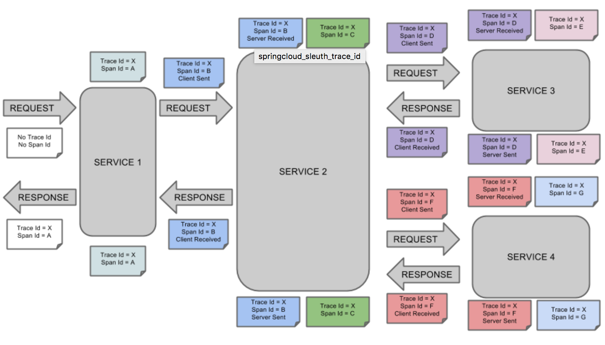

# 链式追踪 zipkinServer
## 前言
   针对服务化应用全链路追踪的问题，Google发表了Dapper论文，介绍了他们如何进行服务追踪分析。其基本思路是在服务调用的请求和响应中加入ID，标明上下游请求的关系。利用这些信息，可以可视化地分析服务调用链路和服务间的依赖关系。
Zipkin是 Twitter 对 Dapper 的实现，支持多种语言。
## Spring Cloud Sleuth
Spring Cloud Sleuth是对Zipkin的一个封装，对于Span、Trace等信息的生成、接入HTTP Request，以及向Zipkin Server发送采集信息等全部自动完成。

- 使用 cloud 实现的客户端只需要加入以下依赖，实现少量配置即可完成客户端向 RabbitMQ 发送消息。
```
  </dependencies>
    <dependency>
      <groupId>org.springframework.cloud</groupId>
      <artifactId>spring-cloud-sleuth-zipkin-stream</artifactId>
    </dependency>
    <dependency>
      <groupId>org.springframework.cloud</groupId>
      <artifactId>spring-cloud-starter-stream-rabbit</artifactId>
    </dependency>
    <dependency>
      <groupId>org.springframework.cloud</groupId>
      <artifactId>spring-cloud-starter-sleuth</artifactId>
    </dependency>
  </dependencies>
  <!-- 引入spring cloud的依赖 -->
  <dependencyManagement>
    <dependencies>
      <dependency>
        <groupId>org.springframework.cloud</groupId>
        <artifactId>spring-cloud-dependencies</artifactId>
        <version>${spring-cloud.version}</version>
        <type>pom</type>
        <scope>import</scope>
      </dependency>
    </dependencies>
  </dependencyManagement>
```
- 在 application.yaml 或 bootstrap.yaml加入以下配置
```
spring:
  sleuth:
    sampler:
      percentage: 1.0 #用以配置收集样例比例
  rabbitmq:
    username: admin
    password: root123
    addresses: 10.39.232.235,10.39.232.236
```
sleuth 默认会使用通道名称为 sleuth.sleuth 的 QUEUE 进行消息发送
## zipkinServer
本项目是为了实现 Spring Cloud 封装的 zipkinServer，项目通过接收 
RabbitMQ 中 名称为 sleuth.sleuth 的 QUEUE中的消息，并存储在 elasticsearch 中。
- 启动项目需要添加 elasticsearch 配置以及RabbitMQ 配置如下：需要注意的是，因为当前版本的配置
 bug 导致 elasticsearch.hosts只支持配置文件为 properties，不能为 yaml
```
management.health.redis.enabled=false
spring.cloud.consul.discovery.register=true
zipkin.storage.type=elasticsearch
zipkin.storage.elasticsearch.hosts=10.39.232.127:9300,10.39.232.128:9300
zipkin.storage.elasticsearch.cluster=elasticsearch
spring.rabbitmq.addresses=10.39.232.235,10.39.232.236
spring.rabbitmq.username=admin
spring.rabbitmq.password=root123
```
- zipkinServer for RabbiMQ 依赖如下，另外值得注意的是，zipkin 客户端和 server 端springcloud 需版本一致，否则会出现反序列化失败的情况
```
        <!--zipkinserver -->
        <dependency>
            <!-- sleuth-zipkin-stream 包中已经包含该依赖，但 Dalston.SR2版本对应的不支持 es 5.x-->
            <groupId>io.zipkin.java</groupId>
            <artifactId>zipkin</artifactId>
            <version>1.24.0</version>
        </dependency>
        <dependency>
            <groupId>org.springframework.cloud</groupId>
            <artifactId>spring-cloud-sleuth-zipkin-stream</artifactId>
        </dependency>
        <dependency>
            <groupId>io.zipkin.java</groupId>
            <artifactId>zipkin-autoconfigure-ui</artifactId>
            <scope>runtime</scope>
        </dependency>
        <dependency>
            <groupId>org.springframework.cloud</groupId>
            <artifactId>spring-cloud-stream-binder-rabbit</artifactId>
        </dependency>
        <dependency>
            <groupId>io.zipkin.java</groupId>
            <artifactId>zipkin-autoconfigure-storage-elasticsearch-http</artifactId>
            <version>1.24.0</version>
        </dependency>
```
